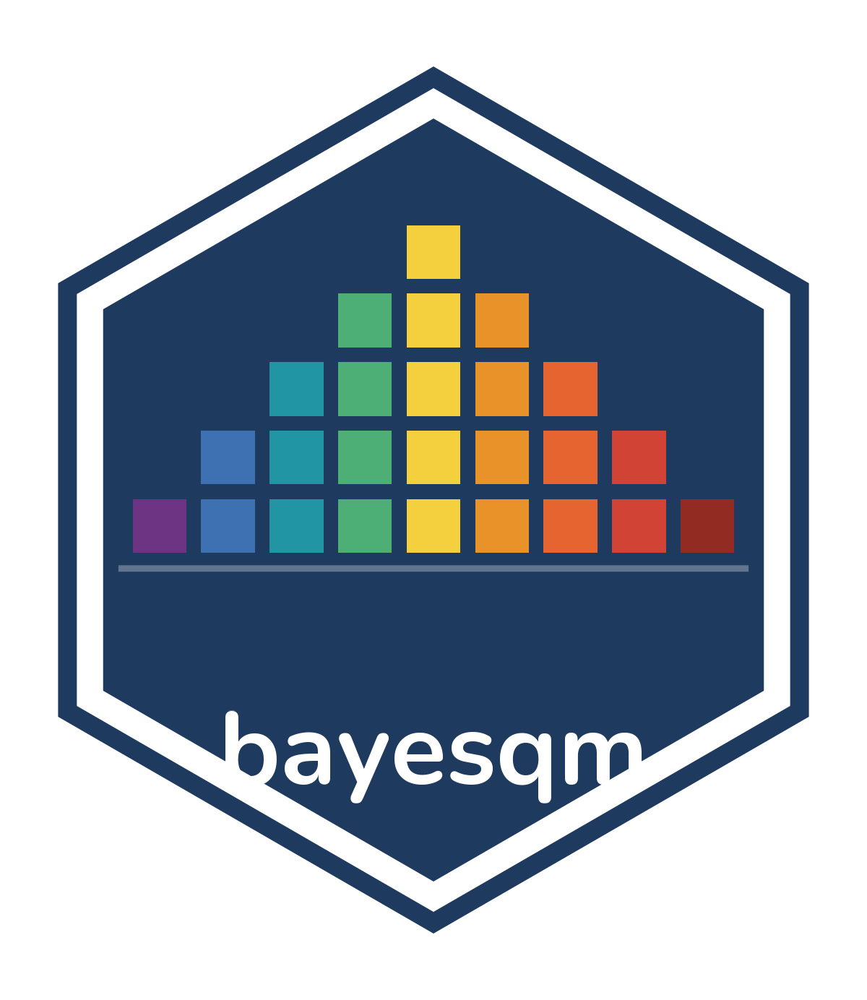
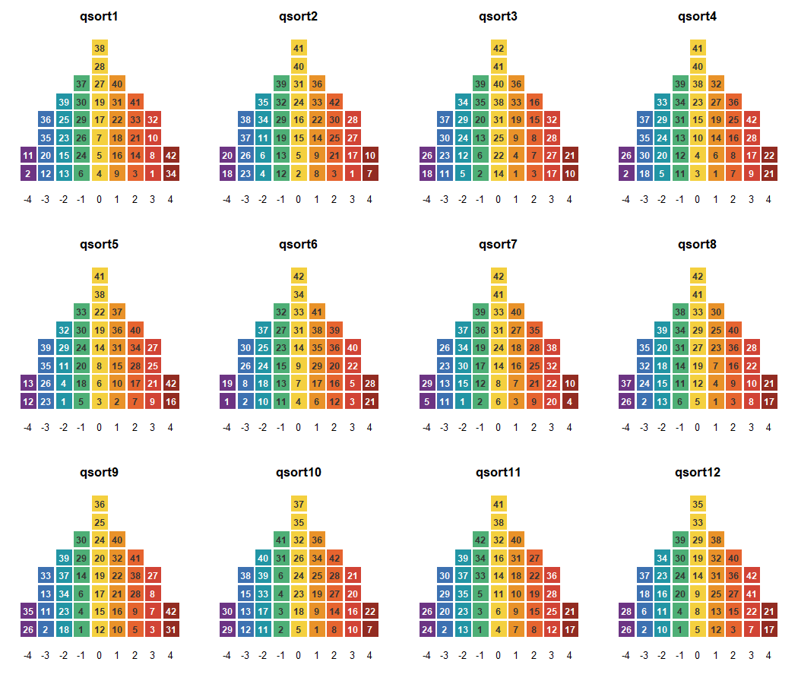
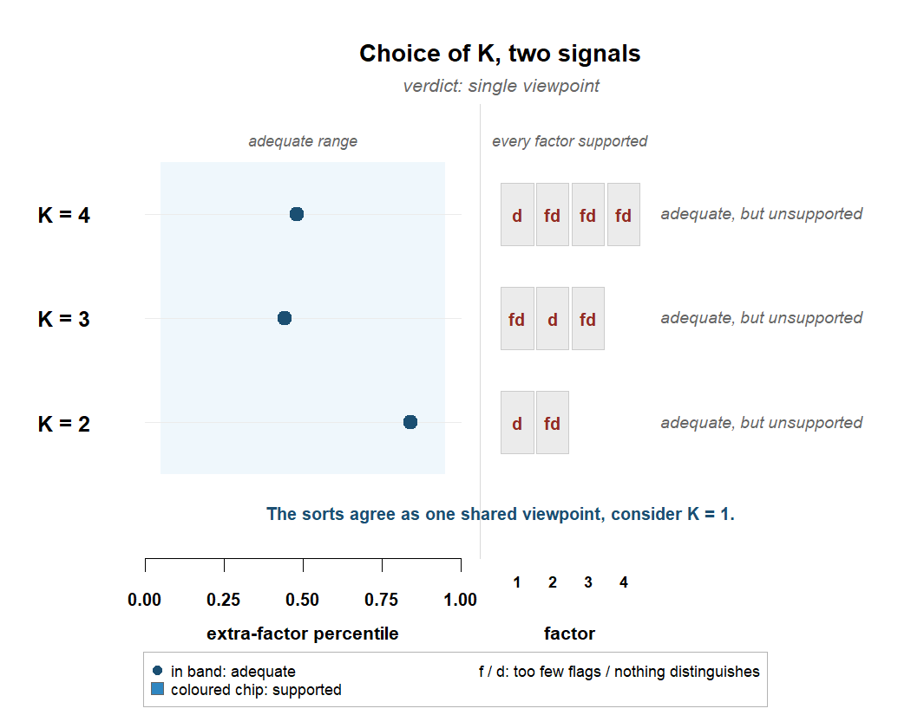
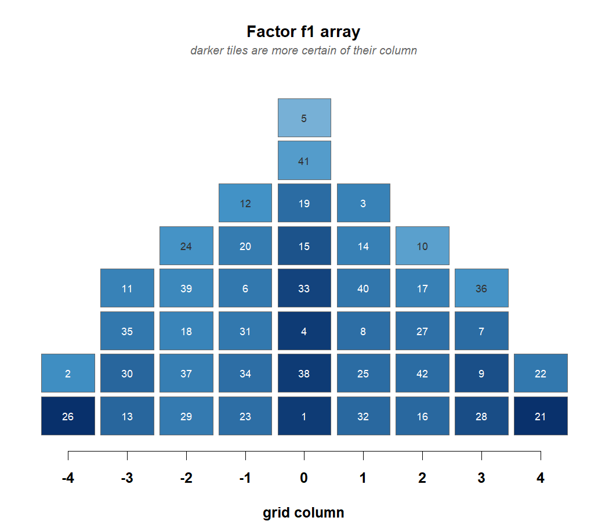
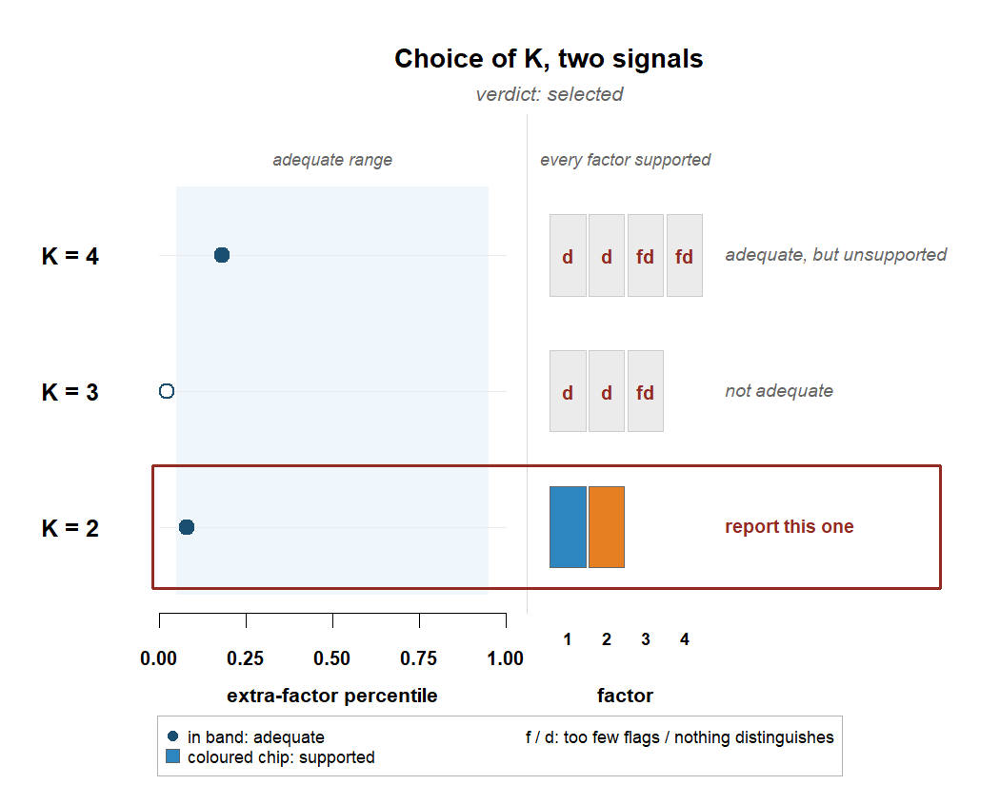
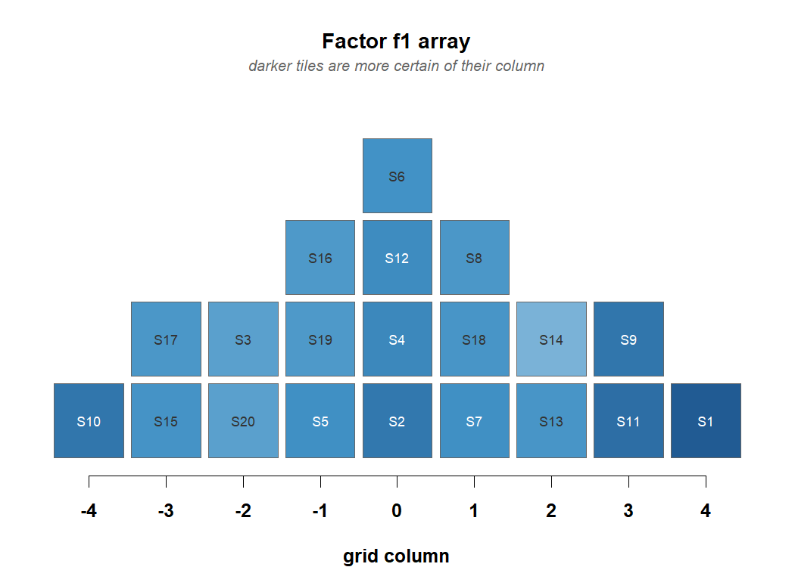
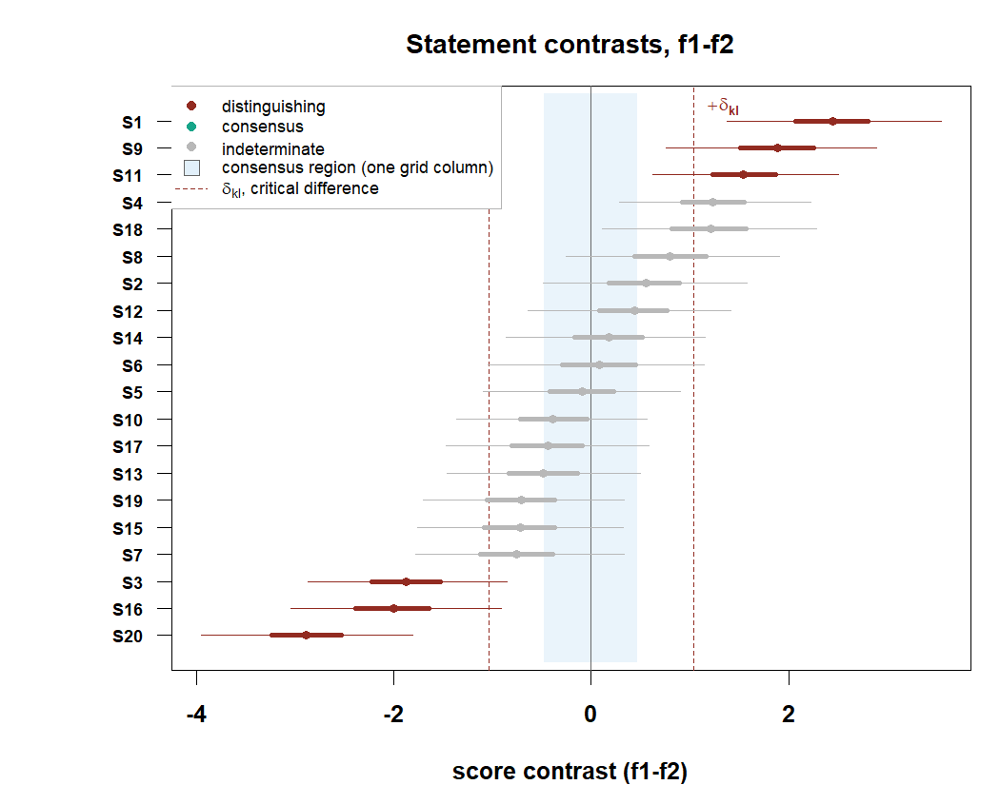

<!-- README.md is generated from README.Rmd. Edit README.Rmd, then knit. -->

# bayesqm 

<!-- badges: start -->

[](https://github.com/rdazadda/bayesqm/actions/workflows/R-CMD-check.yaml)
[](https://cran.r-project.org/web/licenses/GPL-3)
<!-- badges: end -->

**bayesqm turns forced Q sorts into the full set of Q-methodology
reports, each carrying its posterior uncertainty.** It reads the common
study formats, PQMethod `.DAT`, Ken-Q, KADE, HTMLQ and FlashQ exports,
CSV and Excel grids, and models the sort itself: each participant places
every statement into a fixed grid, the quotas make that placement an
ordered partition of the statement set, and the package computes the
probability of the observed partition exactly. From one panel it derives
what a Q study reports, bounded loadings, flags, factor arrays,
statement scores, distinguishing and consensus statements, the number of
factors, and the checks behind them. Every analysis returns an object
that prints its own summary and draws its own plots.

Every decision states its rule. One posterior false-discovery rule
selects everything the analysis reports, flags, distinguishing listings,
consensus statements, and pairwise stars, and gives the expected number
of false claims alongside. The number of factors is decided by two
checks read together, whether K factors account for the panel and
whether every factor earns its place. Quantities classical practice
fixes by convention, above all the critical difference behind
distinguishing statements, are estimated from the posterior instead, and
the alignment of the posterior draws follows the MatchAlign procedure of
Poworoznek et al. (2025). The implementation is checked two ways,
against planted truth in simulation and against the `qmethod` reference
implementation wherever both compute the same object, and those checks
run live in the validation article on the package website.

You can usually see the answer before you compute it. Plot the sorts and
each completed grid becomes its own pyramid, every statement on its
tile, the color giving the column it was placed in. Two like-minded
sorters put the same statements under the same colors, and a panel that
shares one viewpoint repeats itself pyramid after pyramid. The numbers
that follow put a figure to what the picture shows.

## Installation

``` r
# install.packages("remotes")
remotes::install_github("rdazadda/bayesqm")
```

CRAN still carries 0.1.0, an earlier model fitted through Stan. This
version is a different model with its own sampler. Install from GitHub
until 0.2.0 reaches CRAN.

## A first analysis

One real panel ships with the package, the childhood obesity study of
Akhtar-Danesh (2023), so this runs without any data of your own. 33
participants sorted 42 statements about childhood obesity onto a
nine-column grid.

``` r
library(bayesqm)

obesity_sorts
#> Q-sort data
#>   statements  : 42   participants : 33 
#>   distribution: 2 4 5 6 8 6 5 4 2   (sum = 42 )
#>   value range : [-4, 4]
#>   source      : excel:Childhood obesity dataset.xlsx
plot(obesity_sorts, participants = 1:12)
```



How many viewpoints does the panel hold? Fit two, three, and four
factors and let two checks read each candidate. One asks whether K
factors account for the shared structure. The other asks whether every
factor earns its place, meaning at least two participants define it and
at least one statement sets it apart from the rest.

``` r
sel <- select_k(fit_ladder(obesity_sorts, K_min = 2, K_max = 4,
                           seed = 11, quiet = TRUE))
plot_choice_k(sel)
```



The classical analysis of this panel reports three factors. Here every K
accounts for the panel and no factor at any K is set apart by a single
statement, so the rule refuses to select, and the verdict names what the
sorts show. One shared viewpoint. The one-factor fit is then the panel’s
report, and its array is the shared sort itself.

``` r
fit1 <- fit_bayesian(obesity_sorts, K = 1, seed = 11)
#> grid labels -4..4 recoded onto categories 1..9 (a monotone relabeling; the sorts are unchanged)
plot_factor_array(fit1)
```



Darker tiles are placements the posterior is more certain of. Each of
these fits takes a minute or two.

## When there are two viewpoints

Simulated sorts with two planted viewpoints, so the right answer is
known and the multi-factor reports have something to find.

``` r
sim <- generate_data(N = 14, J = 20, K = 2, noise_sd = 0.6,
                     primary_range = c(0.65, 0.9), seed = 7)
qdata <- qsort_data(sim$Y, distribution = sim$distribution)

lad <- fit_ladder(qdata, K_min = 2, K_max = 4, seed = 7, quiet = TRUE)
plot_choice_k(select_k(lad))
```



Two factors pass both checks, boxed on their row. Fit that model. The
sampler runs until a convergence check passes, and the printout reports
it.

``` r
fit <- fit_bayesian(qdata, K = 2, seed = 7)
#> grid labels -4..4 recoded onto categories 1..9 (a monotone relabeling; the sorts are unchanged)
fit
#> bayesqm fit: exact partition (rank-order) likelihood, PX-Gibbs
#>   14 participants, 20 statements, 2 factors; grid 1-2-2-3-4-3-2-2-1
#>   draws: 2000 kept (12000 iterations, burn 2000, thin 5)
#>   gate: passed (max Rhat 1.003; min ESS 1255 bulk / 1606 tail)
#>   alignment: pivot draw 332, mean congruence 0.89
#>   tables: compute_loadings(), compute_flags(), compute_factor_array(),
#>           compute_qdc(), claims()
```

What gets reported is decided by one rule. `claims()` keeps the most
probable flags, distinguishing statements, consensus statements, and
pairwise stars, and stops adding claims when the expected share of false
ones passes five percent.

``` r
claims(fit)
#> Selected claims at q = 0.05 (posterior expected FDR):
#>   flags             9 participants selected (expected false 0.41)
#>   distinguishing   11 listings selected (expected false 0.47)
#>   consensus         0 statements selected (expected false 0.00)
#>   stars             5 pairwise selected (expected false 0.17)
```

Behind the counts sit the full tables, and two of the views show the
result at a glance. The reported sort for each factor, on its own grid:

``` r
plot_factor_array(fit)
```



And statement by statement, where the two viewpoints separate and where
they agree:

``` r
plot_contrasts(fit)
```



## What the package covers

**Import.** `read_qsort()` reads CSV, Excel (HTMLQ, FlashQ, and tablet
exports), PQMethod `.DAT`, Ken-Q JSON and Excel, KADE ZIP, and
Easy-HTMLQ Firebase JSON. Grids labeled `-4..+4`, from zero, or with any
distinct printed values work as they are, and the sorts are never
altered. `qsort_data()` builds the object from a plain matrix, and
`plot()` on it draws the pyramids.

**The tables.** `compute_loadings()` gives bounded loadings with
credible intervals, `compute_flags()` flag probabilities with an
explicit unclassified state, `compute_factor_array()` quota-exact
arrays, `compute_zscores()` statement scores, and `compute_qdc()`
distinguishing and consensus verdicts against a posterior critical
difference and the one-grid-column region. `factor_characteristics()` is
the per-factor block a results section quotes, and `claims()` selects
what gets reported. `rename_factors()` relabels every table at once, and
`rotate_factors()` and `flip_factor()` apply judgmental rotation to
every draw.

**The number of factors.** `fit_ladder()` fits the candidate models,
`select_k()` applies the two checks, and `plot_choice_k()` draws the
whole decision. `loo_ladder()` adds PSIS-LOO as directional
corroboration.

**Checks.** `check_fit()` runs the posterior-predictive checks, and
`check_persons()` separates sorts the model spans from shared viewpoints
it does not. Every fit passes a convergence check before it returns, and
`extend()` continues a chain draw for draw.

**Plots and draws.** The 11 views share one style, from the raw sorts to
the reported arrays, with `ggplot2::autoplot()` methods for loadings,
flags, contrasts, and the array; `bayesqm_set_colors()` themes them and
`save_bayesqm_plot()` writes the figures. `as.matrix()`, `as.array()`,
and `as.data.frame()` return the draws under Stan-style names, and the
`posterior::as_draws_*()` family is registered, so `bayesplot` and
`tidybayes` read a fit directly.

## Documentation

The package website is <https://rdazadda.github.io/bayesqm/>.
`vignette("bayesqm-intro")` walks one analysis end to end, and
`vignette("output-codebook")` defines every column of every reported
table. The articles go deeper: the validation checks, the decision rules
with a worked example of each verdict, and a start-to-finish walkthrough
of the obesity panel. The reference index groups every function by task,
and issues belong at <https://github.com/rdazadda/bayesqm/issues>.

## Citation

`citation("bayesqm")` gives the reference. Report the version with
`packageVersion("bayesqm")`.

## License

GPL (\>= 3); see <https://cran.r-project.org/web/licenses/GPL-3> for the
full text.

bayesqm is developed and maintained at the Center for Alaska Native
Health Research, University of Alaska Fairbanks.
