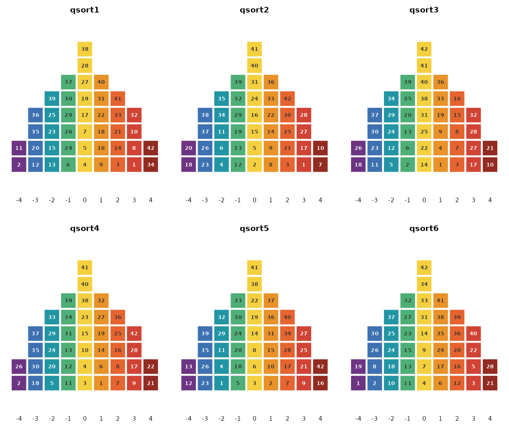
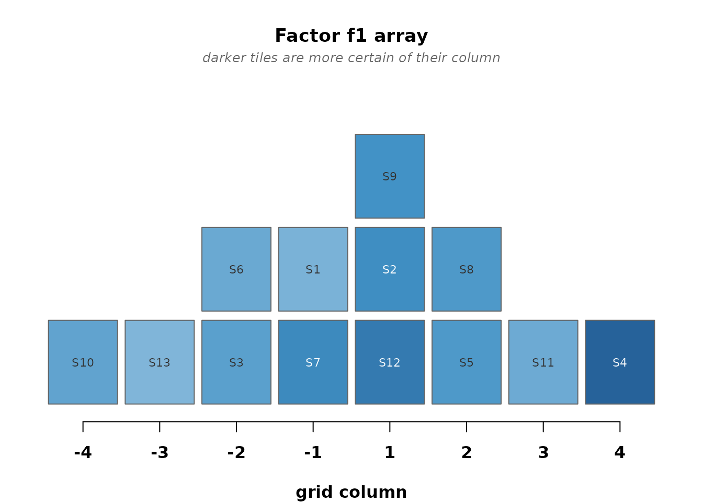
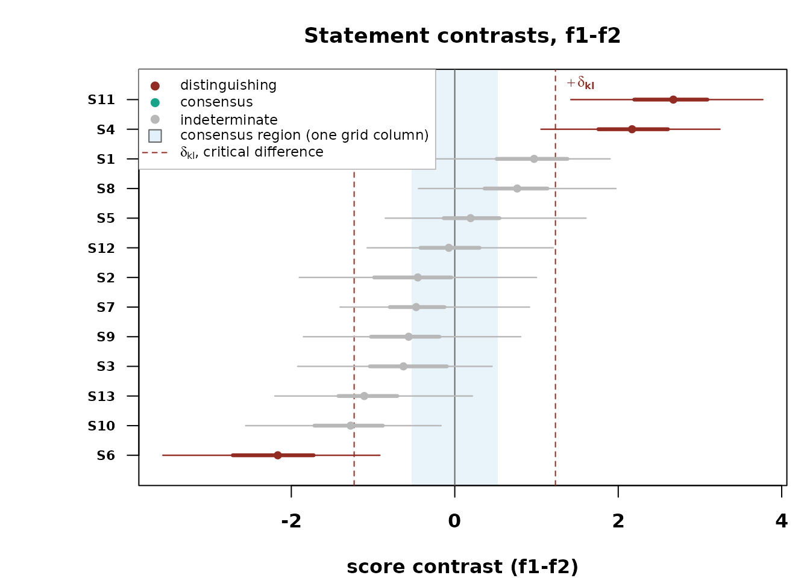

# Getting started with bayesqm

You have a stack of completed Q sorts and a practical question. How many
viewpoints does the panel hold, who holds each one, and which statements
set them apart? `bayesqm` answers from a model of the sorting event
itself. Each participant placed every statement into a fixed grid, the
quotas make that placement an ordered partition of the statement set,
and the package computes the probability of the observed partition
exactly. The tables that come back are the ones a Q study reports, with
the uncertainty of every entry.

This vignette walks one analysis end to end on a small demonstration
fit, so it knits in seconds. On real data, replace
[`demo_fit()`](https://rdazadda.github.io/bayesqm/reference/demo_fit.md)
with
[`fit_bayesian()`](https://rdazadda.github.io/bayesqm/reference/fit_bayesian.md).
A fit at typical panel sizes takes a minute or two.

## The sorts

[`read_qsort()`](https://rdazadda.github.io/bayesqm/reference/read_qsort.md)
reads the common formats. CSV and Excel grids, PQMethod `.DAT`, Ken-Q
JSON and multi-sheet Excel, KADE ZIP exports, and Easy-HTMLQ Firebase
JSON.

``` r

qdata <- read_qsort("mystudy.dat")        # PQMethod file, for example
qdata <- qsort_data(Y, distribution = c(2, 3, 4, 5, 4, 3, 2))
```

One scope note up front. The exact likelihood is a statement about the
forced sorting event, so
[`fit_bayesian()`](https://rdazadda.github.io/bayesqm/reference/fit_bayesian.md)
requires every sort to match the design grid and names any participant
who does not. Free-distribution studies, which Ken-Q, HTMLQ, and KADE
permit, are outside this model’s scope. The import functions still read
them for inspection.

Before any model runs, look at what the participants actually did.
`plot(qdata)` draws every completed sort as its own pyramid, one tile
per statement, the color giving the column it was placed in. Here on
`obesity_sorts`, the childhood obesity panel of Akhtar-Danesh
([2023](#ref-AkhtarDanesh2023)) that ships with the package.
Thirty-three participants, forty-two statements, a nine-column grid.

``` r

data(obesity_sorts)
plot(obesity_sorts, participants = 1:6)
```



A reversed sorter, a pattern shared by nobody, a data-entry slip, all of
it shows up here first, while it is still a data question rather than a
modeling one.

## The fit

``` r

fit <- demo_fit(seed = 1)
fit
#> bayesqm fit: exact partition (rank-order) likelihood, PX-Gibbs
#>   8 participants, 13 statements, 2 factors; grid 1-1-2-2-3-2-1-1
#>   draws: 200 kept (500 iterations, burn 100, thin 2)
#>   gate: passed (max Rhat 1.053; min ESS 36 bulk / 98 tail)
#>   alignment: pivot draw 33, mean congruence 0.78
#>   tables: compute_loadings(), compute_flags(), compute_factor_array(),
#>           compute_qdc(), claims()
```

The header carries what a fit is. The likelihood, the panel, the draws,
the convergence check, and the alignment. Convergence is judged on
summaries that do not depend on rotation, and a chain that misses the
bar is extended at successive doublings up to a cap. If it still misses,
the fit warns, and `extend(fit)` continues exactly where it stopped,
draw for draw identical to one longer run. Rotational, sign, and label
ambiguity is resolved by the MatchAlign procedure of Poworoznek et al.
([2025](#ref-PoworoznekEtAl2025)) with a polarity rule, so defining
sorts load positively and every summary comes from one common
orientation.

## Who holds each viewpoint

Loadings on a bounded correlation scale, with credible intervals.

``` r

head(compute_loadings(fit))
#>   participant  f1_loading   f1_lower  f1_upper  f2_loading   f2_lower
#> 1          P1  0.69758061  0.3510298 0.8852994 -0.35029454 -0.6733120
#> 2          P2 -0.11857555 -0.4985179 0.2018393  0.67754437  0.1103558
#> 3          P3  0.71649641  0.4107087 0.9122487  0.15110204 -0.3070454
#> 4          P4 -0.06232255 -0.4502353 0.3744591  0.64745185  0.1622277
#> 5          P5  0.74401521  0.3315242 0.9250481  0.02104403 -0.3902214
#> 6          P6  0.32643262 -0.1344789 0.6793355  0.40741163 -0.1900813
#>     f2_upper    spread
#> 1 0.06053878 1.5259877
#> 2 0.93709993 1.2808817
#> 3 0.51003980 1.3814252
#> 4 0.89838180 1.1044914
#> 5 0.42913354 1.4169065
#> 6 0.78570220 0.8629496
```

A flag probability is the posterior share of draws in which a
participant defines the factor, and the unclassified state keeps
cross-loading and abstention visible instead of forcing a yes or no.

``` r

compute_flags(fit)
#>   participant factor sign flag_prob unclassified_prob selected
#> 1          P1     f1    1     0.840             0.120    FALSE
#> 2          P2     f2    1     0.795             0.195    FALSE
#> 3          P3     f1    1     0.875             0.120    FALSE
#> 4          P4     f2    1     0.750             0.250    FALSE
#> 5          P5     f1    1     0.895             0.105    FALSE
#> 6          P6     f2    1     0.325             0.520    FALSE
#> 7          P7     f1    1     0.785             0.195    FALSE
#> 8          P8     f2    1     0.330             0.645    FALSE
```

## What each viewpoint says

The factor array is the viewpoint written as a completed sort,
quota-exact by construction.

``` r

head(compute_factor_array(fit))
#>   statement f1_grid f2_grid
#> 1        S1       4       1
#> 2        S2       5       6
#> 3        S3       3       3
#> 4        S4       8       3
#> 5        S5       6       6
#> 6        S6       3       8
```

``` r

plot_factor_array(fit)
```



Darker tiles are placements the posterior is more certain of.

## Where they differ and where they agree

The critical difference is computed from the posterior spread of each
score contrast, and consensus is a positive finding, the event that
every factor places a statement within one grid column of the others. A
statement can be distinguishing, consensus, or neither.

``` r

qdc <- compute_qdc(fit)
table(qdc$verdict)
#> 
#> distinguishing (f1, f2)     distinguishing (f1)           indeterminate 
#>                       2                       1                      10
```

``` r

plot_contrasts(fit)
```



## What gets reported

One rule decides.
[`claims()`](https://rdazadda.github.io/bayesqm/reference/claims.md)
keeps the most probable flags, distinguishing statements, consensus
statements, and pairwise stars, and stops adding claims when the
expected share of false ones passes the level you set.

``` r

claims(fit, q = 0.05)
#> Selected claims at q = 0.05 (posterior expected FDR):
#>   flags             0 participants selected (expected false 0.00)
#>   distinguishing    5 listings selected (expected false 0.25)
#>   consensus         0 statements selected (expected false 0.00)
#>   stars             2 pairwise selected (expected false 0.08)
```

## The per-factor block

[`factor_characteristics()`](https://rdazadda.github.io/bayesqm/reference/factor_characteristics.md)
is the summary a results section quotes. How many sorts define each
factor, with an interval, how spread the factor’s statement scores are,
and how reliable its defining sorts are.

``` r

factor_characteristics(fit)
#>   factor flagged defining_modal defining_mean defining_lower defining_upper
#> 1     f1       0              4         3.585              2              5
#> 2     f2       0              2         2.265              1              4
#>   score_spread reliability
#> 1    0.4153759          NA
#> 2    0.5072720          NA
```

## Checking the model

``` r

check_fit(fit, draws = 30)
#> Posterior-predictive checks (30 replicated draws):
#>   agreement check (T1a):        p = 0.60
#>   extra-factor check (T1b):     observed e_(K+1) at percentile 0.33
#>   paired-comparison check (T2): p = 0.30 (worst statement 0.20)
#>   diagnostics to read, not tests to pass
```

The person check separates sorts the model spans from shared viewpoints
it does not.

``` r

check_persons(fit, draws = 15, mixes = 30)
#> Person check: fits 8, no_shared 0, unspanned 0, atypical 0 
#>  participant    m    w partner partner_index verdict
#>           P1 0.75 0.67      P3             3    fits
#>           P2 0.76 0.71      P4             4    fits
#>           P3 0.76 0.71      P5             5    fits
#>           P4 0.68 0.71      P2             2    fits
#>           P5 0.80 0.71      P3             3    fits
#>           P6 0.48 0.62      P5             5    fits
#>           P7 0.72 0.67      P5             5    fits
#>           P8 0.36 0.39      P6             6    fits
```

## How many viewpoints

[`fit_ladder()`](https://rdazadda.github.io/bayesqm/reference/fit_ladder.md)
fits a ladder of candidate K and
[`select_k()`](https://rdazadda.github.io/bayesqm/reference/select_k.md)
applies two checks together. Adequacy asks whether K factors account for
the shared structure in the panel. Support asks whether every factor
earns its place, meaning at least two selected flags and one selected
distinguishing statement. Expect one fit’s runtime per rung.

``` r

ladder <- fit_ladder(qdata)
select_k(ladder)
plot_choice_k(select_k(ladder))
```

[`loo_ladder()`](https://rdazadda.github.io/bayesqm/reference/loo_ladder.md)
adds PSIS-LOO ([Vehtari et al., 2017](#ref-VehtariEtAl2017)) as
directional corroboration only. At typical Q panel sizes its standard
errors cannot certify adjacent K.

## Coming from PQMethod or qmethod

The outputs you know have direct counterparts. Flagging, automatic or by
hand, becomes
[`compute_flags()`](https://rdazadda.github.io/bayesqm/reference/compute_flags.md),
and [`claims()`](https://rdazadda.github.io/bayesqm/reference/claims.md)
selects the flags at your false-discovery level. The loadings table is
[`compute_loadings()`](https://rdazadda.github.io/bayesqm/reference/compute_loadings.md),
the factor arrays and z-scores are
[`compute_factor_array()`](https://rdazadda.github.io/bayesqm/reference/compute_factor_array.md)
and
[`compute_zscores()`](https://rdazadda.github.io/bayesqm/reference/compute_zscores.md),
and the distinguishing and consensus statements are the three-way
verdicts of
[`compute_qdc()`](https://rdazadda.github.io/bayesqm/reference/compute_qdc.md).
In place of eigenvalue rules and parallel analysis, the number of
factors comes from
[`fit_ladder()`](https://rdazadda.github.io/bayesqm/reference/fit_ladder.md)
and
[`select_k()`](https://rdazadda.github.io/bayesqm/reference/select_k.md).
Explained variance alone has no counterpart in a generative model.
Report the defining-sort counts from
[`factor_characteristics()`](https://rdazadda.github.io/bayesqm/reference/factor_characteristics.md)
and the extra-factor check from
[`check_fit()`](https://rdazadda.github.io/bayesqm/reference/check_fit.md)
instead.

## Reproducibility

Fits are exactly reproducible given a seed, and
[`extend()`](https://rdazadda.github.io/bayesqm/reference/extend.md)
preserves that. It restores the sampler’s saved random-number state, so
continuing a chain after any amount of unrelated R work gives the same
draws as one uninterrupted run.

## Where next

The remaining views are
[`plot_zscores()`](https://rdazadda.github.io/bayesqm/reference/plot_zscores.md)
for the whole statement panel,
[`plot_statement()`](https://rdazadda.github.io/bayesqm/reference/plot_statement.md)
for one statement in depth,
[`plot_loading_posterior()`](https://rdazadda.github.io/bayesqm/reference/plot_loading_posterior.md),
[`plot_flags()`](https://rdazadda.github.io/bayesqm/reference/plot_flags.md),
[`plot_person_check()`](https://rdazadda.github.io/bayesqm/reference/plot_person_check.md),
[`plot_convergence()`](https://rdazadda.github.io/bayesqm/reference/plot_convergence.md),
and
[`plot_ppc()`](https://rdazadda.github.io/bayesqm/reference/plot_ppc.md),
with
[`ggplot2::autoplot()`](https://ggplot2.tidyverse.org/reference/autoplot.html)
methods for loadings, flags, contrasts, and the array. The reference
index at <https://rdazadda.github.io/bayesqm/> groups every function by
task.

## References

Akhtar-Danesh, N. (2023). Impact of factor rotation on Q-methodology
analysis. *PLOS ONE*, *18*(9), 1–11.
<https://doi.org/10.1371/journal.pone.0290728>

Poworoznek, E., Anceschi, N., Ferrari, F., & Dunson, D. (2025).
Efficiently resolving rotational ambiguity in Bayesian matrix sampling
with matching. *Bayesian Analysis*, 1–22.
<https://doi.org/10.1214/25-BA1544>

Vehtari, A., Gelman, A., & Gabry, J. (2017). Practical Bayesian model
evaluation using leave-one-out cross-validation and WAIC. *Statistics
and Computing*, *27*(5), 1413–1432.
