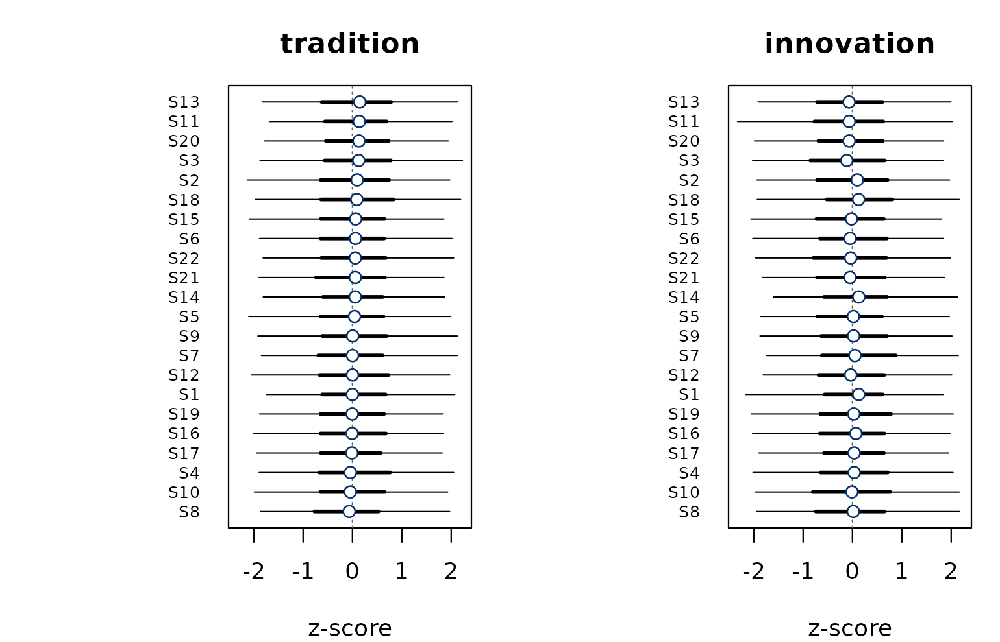

# Getting started with bayesqm

This vignette walks through one Q study end to end in **bayesqm**:
import, fit, diagnose, interpret, select K, and export. The structure
mirrors the classical `qmethod` workflow so readers can map every step
onto its Bayesian analogue.

On your own machine, you would fit a real model with
[`fit_bayesian()`](https://rdazadda.github.io/bayesqm/reference/fit_bayesian.md)
via a Stan backend. For this document we work from a synthetic fit
produced by
[`demo_fit()`](https://rdazadda.github.io/bayesqm/reference/demo_fit.md)
so every plot and summary below renders without requiring Stan.

``` r
library(bayesqm)
```

## The Q-sort data

A Q study asks each participant to rank-order a set of statements into a
forced distribution. `bayesqm` represents that as a `J × N` numeric
matrix (statements as rows, participants as columns) plus a vector of
forced-distribution counts. For a real study,
[`read_qsort()`](https://rdazadda.github.io/bayesqm/reference/read_qsort.md)
auto-detects the file format:

``` r
qdata <- read_qsort("mystudy.csv")   # CSV / Excel / HTMLQ / FlashQ
qdata <- read_qsort("mystudy.DAT")   # PQMethod
qdata <- read_qsort("mystudy.zip")   # KADE project
```

`qmethod` users can use the dotted aliases instead:
[`import.pqmethod()`](https://rdazadda.github.io/bayesqm/reference/import-aliases.md),
[`import.htmlq()`](https://rdazadda.github.io/bayesqm/reference/import-aliases.md),
[`import.kenq()`](https://rdazadda.github.io/bayesqm/reference/import-aliases.md),
[`import.easyhtmlq()`](https://rdazadda.github.io/bayesqm/reference/import-aliases.md).

For this vignette we simulate a dataset with
[`generate_data()`](https://rdazadda.github.io/bayesqm/reference/generate_data.md)
and wrap it with
[`qsort_data()`](https://rdazadda.github.io/bayesqm/reference/qsort_data.md):

``` r
set.seed(1)
sim   <- generate_data(N = 20, J = 22, K = 2, seed = 1)
qdata <- qsort_data(sim$Y, distribution = sim$distribution,
                    source = "simulated")
qdata
#> Q-sort data
#>   statements  : 22   participants : 20 
#>   distribution: 1 2 3 10 3 2 1   (sum = 22 )
#>   value range : [-3, 3]
#>   source      : simulated
```

## Fitting the model

On real data you would call
[`fit_bayesian()`](https://rdazadda.github.io/bayesqm/reference/fit_bayesian.md):

``` r
fit <- fit_bayesian(qdata, K = 2, chains = 4, iter = 2000,
                    warmup = 1000, seed = 1)
```

The function samples the posterior of a low-rank factor model with a
Student-t likelihood (by default) and a hierarchical normal prior on the
loadings, then resolves rotational ambiguity with MatchAlign. For this
vignette, we use the synthetic fit helper:

``` r
fit <- demo_fit(N = 20, J = 22, K = 2, seed = 1)
fit
#> Bayesian Q-methodology factor model
#>   Call:      fit_bayesian(Y, K = K)
#>   Family:    Student-t (nu = estimated)
#>   Factors:   K = 2
#>   Data:      N = 20 persons, J = 22 statements
#>   Draws:     4 chains x 1000 post-warmup = 4000 total
#>   Backend:   demo
#>   Fitted:    2026-04-24 21:09:47
#>   Max Rhat:  1.010
#>   Min ESS:   bulk 820 / tail 950
#>   Divergent: 0
#> 
#> Factor loadings (posterior median [95% CI], first 10 of 20 persons):
#>     f1                  f2                 
#> P1  0.84 [0.18, 1.51]   -0.01 [-0.74, 0.70]
#> P2  -0.04 [-0.77, 0.69] 0.81 [0.13, 1.47]  
#> P3  0.84 [0.12, 1.58]   0.03 [-0.63, 0.64] 
#> P4  -0.00 [-0.67, 0.72] 0.86 [0.19, 1.61]  
#> P5  0.84 [0.11, 1.57]   -0.01 [-0.68, 0.54]
#> P6  -0.03 [-0.71, 0.72] 0.84 [0.20, 1.45]  
#> P7  0.85 [0.16, 1.49]   -0.01 [-0.63, 0.64]
#> P8  0.04 [-0.74, 0.73]  0.85 [0.15, 1.50]  
#> P9  0.86 [0.14, 1.57]   -0.02 [-0.65, 0.71]
#> P10 -0.03 [-0.76, 0.65] 0.82 [0.18, 1.52]  
#>   ... (10 more; see fit$loa_median / fit$ci_lower / fit$ci_upper)
#> 
#> Hyperparameters:
#>  parameter mean median    sd lower upper
#>         nu 20.0  19.89 3.875 12.62 27.61
#>      sigma  0.5   0.49 0.081  0.36  0.66
#>        tau  0.5   0.50 0.075  0.35  0.63
#> 
#> Use summary() for factor characteristics, distinguishing/consensus tables, and LOO.
```

`summary(fit)` adds factor characteristics, the PSIS-LOO ELPD (when
available), distinguishing-statement counts, and the MatchAlign
diagnostic.

## Diagnostics

Convergence statistics live in `fit$diagnostics`:

``` r
fit$diagnostics
#> $rhat_max
#> [1] 1.01
#> 
#> $ess_bulk
#> [1] 820
#> 
#> $ess_tail
#> [1] 950
#> 
#> $divergences
#> [1] 0
```

[`plot_tucker()`](https://rdazadda.github.io/bayesqm/reference/plot_tucker.md)
visualises the per-draw Tucker’s phi between each aligned factor column
and the MatchAlign pivot. Values near 1 indicate a stable alignment;
bimodality signals residual label-switching.

``` r
plot_tucker(fit)
```


MatchAlign alignment quality by factor.

## Factor loadings

Each participant has a posterior distribution over their loading on
every factor.
[`plot_loading_posterior()`](https://rdazadda.github.io/bayesqm/reference/plot_loading_posterior.md)
draws the loading forest, with nested 50 percent and 95 percent
credible-interval whiskers and the classical Brown cut-off as a faint
reference. Filled points are participants with
`P(factor k dominant) > 0.5`.

``` r
plot_loading_posterior(fit)
```


Loadings with nested 50% and 95% credible intervals.

The same information as a tidy data frame:

``` r
head(compute_loadings(fit$Lambda_draws, prob = 0.95))
#>   participant        f1_loa   f1_lower  f1_upper       f2_loa   f2_lower
#> 1          P1  0.8633310349  0.1777652 1.5113499 -0.009803544 -0.7354845
#> 2          P2 -0.0247606073 -0.7710033 0.6903140  0.820933826  0.1319667
#> 3          P3  0.8370409716  0.1173374 1.5761078  0.021666685 -0.6254377
#> 4          P4  0.0112271359 -0.6681498 0.7150664  0.859657693  0.1945868
#> 5          P5  0.8387401685  0.1094005 1.5680236 -0.003677494 -0.6826606
#> 6          P6 -0.0005321719 -0.7084376 0.7158515  0.852505282  0.1978190
#>    f2_upper
#> 1 0.7007115
#> 2 1.4739589
#> 3 0.6360293
#> 4 1.6134702
#> 5 0.5440355
#> 6 1.4452263
```

## Factor z-scores

[`plot()`](https://rdrr.io/r/graphics/plot.default.html) gives a
cross-panel z-score dotchart; rows share an order (by factor 1’s
posterior mean, configurable via `sort_by`) so the reader can scan
horizontally to compare factors.

``` r
plot(fit)
```


Posterior z-scores across factors with 50 / 95 CrIs.

For a single statement across factors,
[`plot_zscore_posterior()`](https://rdazadda.github.io/bayesqm/reference/plot_zscore_posterior.md)
gives the drill-down:

``` r
plot_zscore_posterior(fit, statement = 1)
```


Posterior z-score for a single statement across factors.

## Choosing K

[`run_bayes()`](https://rdazadda.github.io/bayesqm/reference/run_bayes.md)
fits the model for each K in a range and applies the
**peak-plus-Sivula** protocol: the ELPD peak is the automated choice;
the Sivula (2025) parsimony rule is reported alongside.

``` r
run <- run_bayes(qdata, K_max = 4, seed = 1,
                 chains = 2, iter = 1500, warmup = 800)
run
plot_elpd(run)
```

The `run$case` field labels this relationship. When both methods pick
the same K, the case is `agree` and the data supports that K
unambiguously. When the ELPD peak exceeds the Sivula choice, the case is
`gap`: the richer model fits a bit better on LOO but not decisively, and
the choice between them should turn on substantive evidence. When Sivula
picks a larger K than the peak (`reversed`), something has usually gone
wrong in the ELPD comparison itself; this case is rare in practice and
should not be read as a substantive finding.

## Distinguishing, consensus, and membership

`bayesqm` replaces the classical z-score test with a direct posterior
probability. For every statement and every factor pair,
`P(|f_jk − f_jl| > δ)` answers *how confidently do the factors separate
this statement?* The default `δ = 1` is on the standardised factor-score
scale.

``` r
plot_dist_cons(fit, delta = 1.0)
```


Distinguishing-statement probability. Rows sorted so the most
discriminating statements are at the top.

Participant-level membership is probabilistic too.
[`classify_membership()`](https://rdazadda.github.io/bayesqm/reference/bayesqm-membership.md)
turns posterior dominance into a `Strong / Moderate / Weak` tier:

``` r
head(classify_membership(fit$Lambda_draws))
#>   participant dominant_factor dominant_label max_prob   tier
#> 1          P1               1             f1   0.9300 Strong
#> 2          P2               2             f2   0.9025 Strong
#> 3          P3               1             f1   0.9075 Strong
#> 4          P4               2             f2   0.9375 Strong
#> 5          P5               1             f1   0.8925 Strong
#> 6          P6               2             f2   0.9375 Strong
```

``` r
plot_membership(fit)
```


Dominant-factor posterior probability with tier strip.

## Posterior predictive check

[`plot_ppc()`](https://rdazadda.github.io/bayesqm/reference/plot_ppc.md)
shows the posterior distribution of the RMSE between `cor(Y_rep)` and
`cor(Y_obs)`. A well-specified model puts most mass at small RMSE.

``` r
plot_ppc(fit)
```


PPC on the correlation matrix.

## Hyperparameters

``` r
plot_hyper(fit)
```


Posterior densities of nu, sigma, and tau.

## Reporting and exporting

[`save_bayesqm_plot()`](https://rdazadda.github.io/bayesqm/reference/save_bayesqm_plot.md)
writes any plot to PDF / SVG / PNG / TIFF / JPEG at journal-appropriate
dimensions:

``` r
save_bayesqm_plot("fig_loadings.pdf", plot_loading_posterior(fit))
save_bayesqm_plot("fig_elpd.pdf",      plot_elpd(run),
                  width = 3.5, height = 3)
```

[`caption_bayesqm()`](https://rdazadda.github.io/bayesqm/reference/caption_bayesqm.md)
returns a ready-to-paste figure caption with model configuration, sample
sizes, interval probability, and convergence diagnostics:

``` r
caption_bayesqm(fit)
#> [1] "Bayesian Q-methodology factor model (K = 2, N = 20, J = 22); fitted with a Student-t likelihood via demo (4 chains, 4,000 post-warmup draws); intervals shown at 95% posterior coverage; max Rhat = 1.010, min bulk ESS = 820, 0 divergent transitions. Fitted with the bayesqm R package (Dacosta Azadda, 2026)."
```

Standard R accessors work on the fit (`coef`, `fitted`, `residuals`,
`sigma`, `family`, `as.matrix`), and `as.matrix(fit)` returns a
Stan-style draws matrix that `posterior` and `bayesplot` consume
natively.

## Renaming factors and theming

Substantive factor labels replace `f1..fK` in every slot:

``` r
fit2 <- rename_factors(fit, c("tradition", "innovation"))
plot(fit2)
```



Every plot reads its palette through
[`bayesqm_colors()`](https://rdazadda.github.io/bayesqm/reference/bayesqm-colors.md);
switch the scheme once and every subsequent plot follows:

``` r
bayesqm_set_colors("teal")   # "blue" (default), "red", "purple", "grey"
plot(fit)
bayesqm_set_colors("blue")
```

## Where next

- [`?fit_bayesian`](https://rdazadda.github.io/bayesqm/reference/fit_bayesian.md)
  — every prior and sampler option
- [`?run_bayes`](https://rdazadda.github.io/bayesqm/reference/run_bayes.md)
  — peak-plus-Sivula thresholds
- `?bayesqm-membership` — the full set of membership summaries
- [`ggplot2::autoplot()`](https://ggplot2.tidyverse.org/reference/autoplot.html)
  — ggplot2 / ggdist versions of every view above, when `ggplot2` and
  `ggdist` are installed
