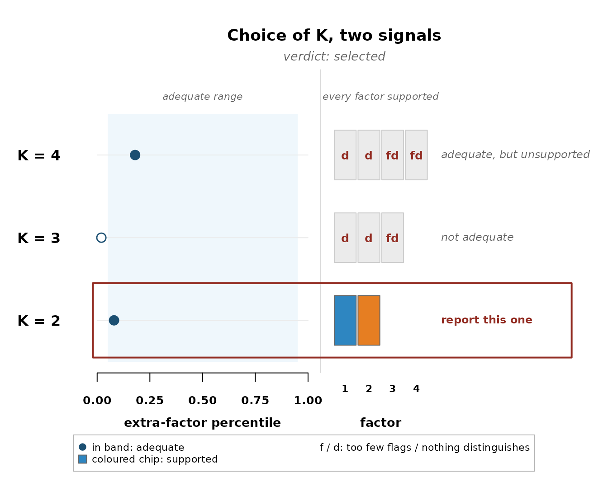

# The decision rules

Two rules sit behind everything the package reports.
[`claims()`](https://rdazadda.github.io/bayesqm/reference/claims.md)
decides what a fitted model may report, and
[`select_k()`](https://rdazadda.github.io/bayesqm/reference/select_k.md)
decides how many factors to fit at all. This article works through both.

## One rule for every claim

A candidate claim is anything the analysis might report. A flag, a
distinguishing statement, a consensus statement, a pairwise star. Each
carries a posterior probability, and the rule is the same for all four
kinds. Rank the candidates by probability, add them from the top, and
stop when the expected share of false claims among those added passes
the level q. Every claim short of probability one contributes its
shortfall, so the expected number of false claims is the sum of one
minus the probability across the selected claims, and the table reports
that number next to the count.

The demonstration fit makes the arithmetic visible. Its strongest flag
candidates:

``` r

fit <- demo_fit(seed = 1)
fl <- compute_flags(fit)
head(fl[order(-fl$flag_prob), c("participant", "factor", "flag_prob")], 5)
#>   participant factor flag_prob
#> 5          P5     f1     0.895
#> 3          P3     f1     0.875
#> 1          P1     f1     0.840
#> 2          P2     f2     0.795
#> 7          P7     f1     0.785
```

At q = 0.05 none of these probabilities is high enough. Even the
strongest candidate would put the expected false share past five percent
on its own, so the rule reports nothing rather than something it cannot
stand behind.

``` r

claims(fit, q = 0.05)
#> Selected claims at q = 0.05 (posterior expected FDR):
#>   flags             0 participants selected (expected false 0.00)
#>   distinguishing    5 listings selected (expected false 0.25)
#>   consensus         0 statements selected (expected false 0.00)
#>   stars             2 pairwise selected (expected false 0.08)
```

Loosen the level and the rule starts admitting candidates, stating the
expected number of false claims it now carries.

``` r

claims(fit, q = 0.25)
#> Selected claims at q = 0.25 (posterior expected FDR):
#>   flags             6 participants selected (expected false 1.06)
#>   distinguishing    9 listings selected (expected false 1.88)
#>   consensus         0 statements selected (expected false 0.00)
#>   stars             4 pairwise selected (expected false 0.62)
```

That is the whole mechanism. The level q is the only setting, and the
expected number of false claims is what it controls.

## Two checks for the number of factors

[`fit_ladder()`](https://rdazadda.github.io/bayesqm/reference/fit_ladder.md)
fits every candidate K and
[`select_k()`](https://rdazadda.github.io/bayesqm/reference/select_k.md)
reads each fit twice. The adequacy check asks whether K factors account
for the shared structure, judged by where the next unused eigenvalue
falls against the model’s own replications, with a warning when the
person check finds a cluster of sorters no factor spans. The support
check asks whether every factor earns its place, at least two selected
flags and at least one selected distinguishing statement. The selected K
is the smallest candidate that passes both.

On a simulated panel with two planted viewpoints, the decision looks
like this:

``` r

sim <- generate_data(N = 14, J = 20, K = 2, noise_sd = 0.6,
                     primary_range = c(0.65, 0.9), seed = 7)
qdata <- qsort_data(sim$Y, distribution = sim$distribution)
lad <- fit_ladder(qdata, K_min = 2, K_max = 4, seed = 7, quiet = TRUE)
plot_choice_k(select_k(lad))
```



Each row ends with its own verdict. K = 4 is adequate but two of its
factors attract nothing, K = 3 fails the adequacy check, and K = 2
passes both, so it is boxed and named.

When no row passes both checks, the rule refuses to select and names
what it sees instead. A panel whose flags pile onto one factor while no
statement separates any pair reads as a single viewpoint, the verdict
the childhood obesity panel receives in its walkthrough. A panel where
no factor attracts even two flags reads as no shared structure. On the
grizzly bear panel, the package’s second shipped dataset, the same
standard resolves the other way, K = 2 passes both checks and the rule
selects two viewpoints. And when adequacy and support each hold
somewhere but never together, the verdict is tension, an instruction to
look at the rows and make the choice openly.

A refusal is a finding. The data can support fewer viewpoints than the
analyst hoped, the rules let that outcome through, and that is what
makes the solutions they do select worth believing.
