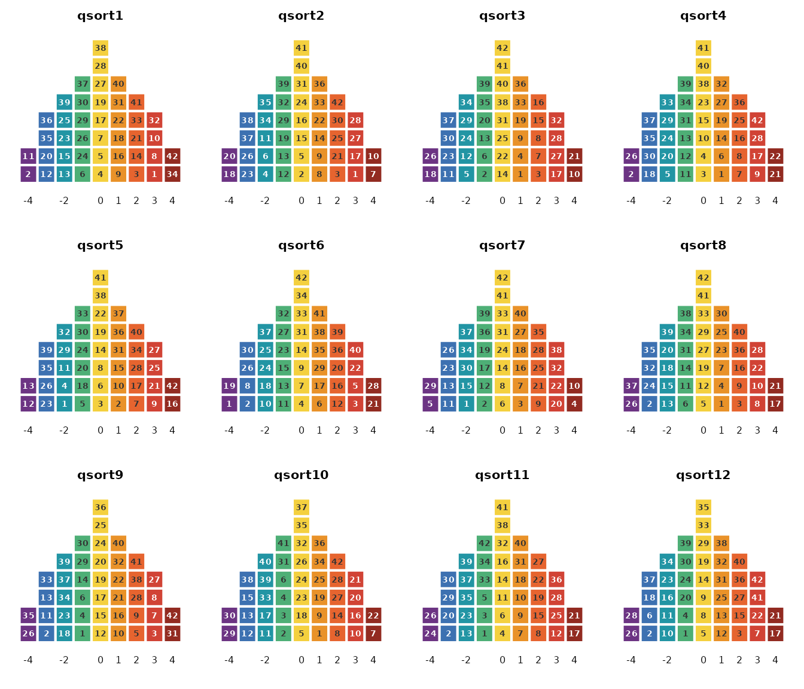
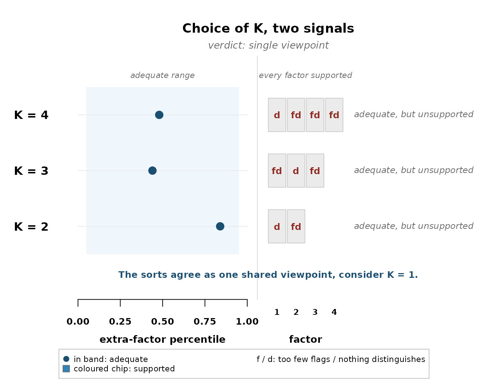
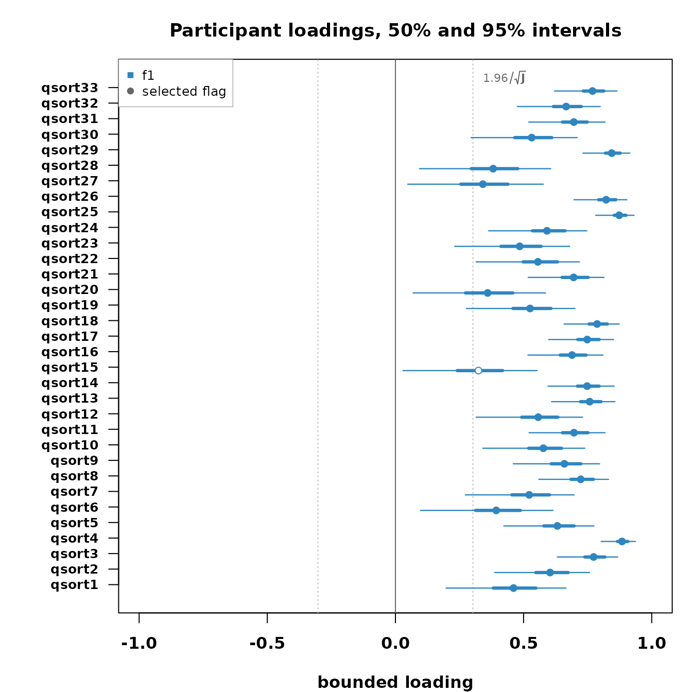
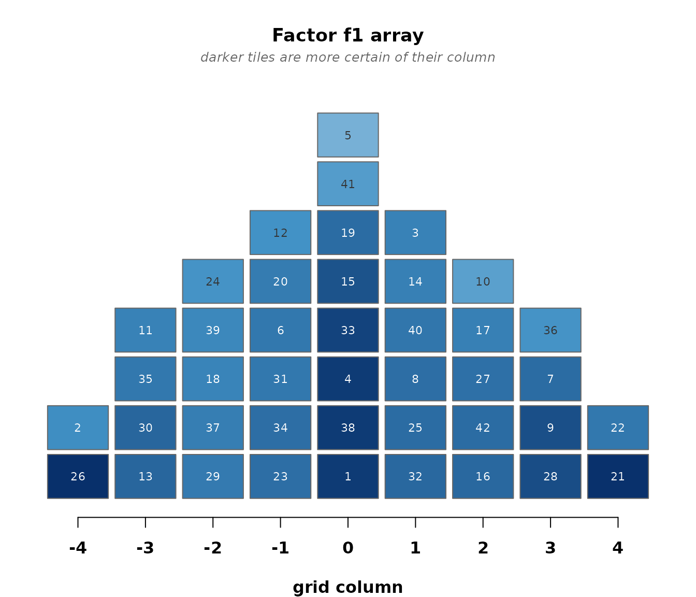
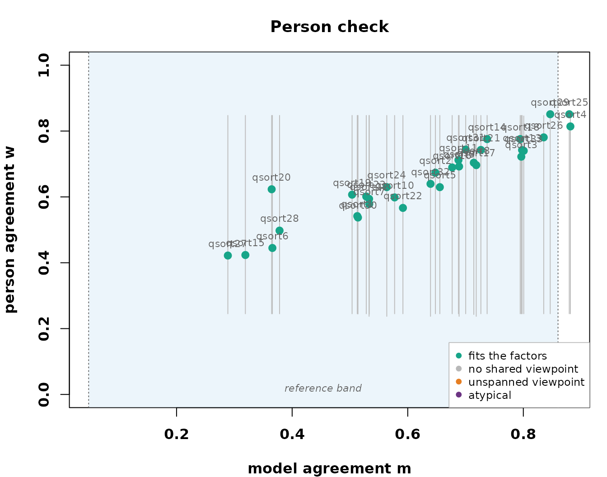

# The obesity panel, start to finish

This walkthrough runs the childhood obesity panel of Akhtar-Danesh
([2023](#ref-AkhtarDanesh2023)) from raw sorts to write-up. The package
front page shows this panel’s headline, the ladder refusing a
multi-factor solution and reading the panel as one shared viewpoint.
Here the analysis goes all the way, with the checks and the tables a
study would quote.

## The sorts

33 participants sorted 42 statements about childhood obesity onto a
nine-column grid.

``` r

data(obesity_sorts)
obesity_sorts
#> Q-sort data
#>   statements  : 42   participants : 33 
#>   distribution: 2 4 5 6 8 6 5 4 2   (sum = 42 )
#>   value range : [-4, 4]
#>   source      : excel:Childhood obesity dataset.xlsx
plot(obesity_sorts, participants = 1:12)
```



## The ladder, row by row

Fit two, three, and four factors and let the two checks read each
candidate.

``` r

sel <- select_k(fit_ladder(obesity_sorts, K_min = 2, K_max = 4,
                           seed = 11, quiet = TRUE))
plot_choice_k(sel)
```



Read the rows. Every dot sits in the band, so every K accounts for the
panel. On the right, one chip at every K carries a `d` alone, that
factor attracts flags but not one statement distinguishes it from the
others, and every other chip carries `fd`, neither flags nor a
distinguishing statement. Flags piling onto one factor while nothing
separates the factors is the signature of a single shared viewpoint, and
the verdict says so. The marijuana panel, the package’s second shipped
dataset, refuses differently, no factor attracts flags at all and the
verdict is no shared structure. The classical analysis of the obesity
panel reports three factors, and the validation article shows how the
two accounts relate, factor by factor.

## The one-factor fit

``` r

fit1 <- fit_bayesian(obesity_sorts, K = 1, seed = 11)
#> grid labels -4..4 recoded onto categories 1..9 (a monotone relabeling; the sorts are unchanged)
fit1
#> bayesqm fit: exact partition (rank-order) likelihood, PX-Gibbs
#>   33 participants, 42 statements, 1 factor; grid 2-4-5-6-8-6-5-4-2
#>   draws: 2000 kept (12000 iterations, burn 2000, thin 5)
#>   gate: passed (max Rhat 1.004; min ESS 1333 bulk / 1272 tail)
#>   alignment: pivot draw 1, mean congruence 0.97
#>   tables: compute_loadings(), compute_flags(), compute_factor_array(),
#>           compute_qdc(), claims()
```

Who carries the shared viewpoint, and how strongly:

``` r

plot_loading_posterior(fit1)
```



With one factor there are no pairs to distinguish, so the claims are the
flags:

``` r

claims(fit1)
#> Selected claims at q = 0.05 (posterior expected FDR):
#>   flags            32 participants selected (expected false 1.54)
#>   distinguishing    0 listings selected (expected false 0.00)
#>   consensus         0 statements selected (expected false 0.00)
#>   stars             0 pairwise selected (expected false 0.00)
```

``` r

factor_characteristics(fit1)
#>   factor flagged defining_modal defining_mean defining_lower defining_upper
#> 1     f1      32             31        31.053             29             33
#>   score_spread reliability
#> 1    0.1784857   0.4350419
```

## The shared sort

The reported array is the viewpoint written as a completed sort, and
with most of the panel behind it, the placements are firm.

``` r

plot_factor_array(fit1)
```



A write-up quotes the poles.
[`crib_sheet()`](https://rdazadda.github.io/bayesqm/reference/crib_sheet.md)
gives the probability of each statement landing in the extreme columns
and of being the single most or least agreed statement:

``` r

cs <- crib_sheet(fit1)
head(cs[order(-cs$p_top), ], 3)
#>    statement factor  p_top p_bottom p_highest p_lowest
#> 21        21     f1 0.9875        0        NA       NA
#> 22        22     f1 0.6265        0        NA       NA
#> 7          7     f1 0.3000        0        NA       NA
head(cs[order(-cs$p_bottom), ], 3)
#>    statement factor p_top p_bottom p_highest p_lowest
#> 26        26     f1     0   0.9960        NA       NA
#> 2          2     f1     0   0.5185        NA       NA
#> 30        30     f1     0   0.2170        NA       NA
```

## The checks

Does one factor account for the panel, and does it span the people?

``` r

check_fit(fit1, draws = 40)
#> Posterior-predictive checks (40 replicated draws):
#>   agreement check (T1a):        p = 0.30
#>   extra-factor check (T1b):     observed e_(K+1) at percentile 0.70
#>   paired-comparison check (T2): p = 0.15 (worst statement 0.07)
#>   diagnostics to read, not tests to pass
pc <- check_persons(fit1)
table(pc$verdict)
#> 
#> fits 
#>   33
plot_person_check(pc)
```



One factor sits comfortably inside every check, and the person check
spans the whole panel. The single viewpoint is not a compromise the
refusal forced, it is the model the data support.

## What you report

The study’s findings are the shared array, the pole shortlists, and the
loadings with their flags, each carrying its uncertainty. The write-up
also owes the reader the ladder, because the single viewpoint is a
decision the checks made, not an assumption. The classical account of
this panel reports three factors, and the two readings are not in
contradiction so much as at different standards of evidence. The
correspondence between them, where it is tight and where it dissolves,
is worked through in the validation article.

Akhtar-Danesh, N. (2023). Impact of factor rotation on Q-methodology
analysis. *PLOS ONE*, *18*(9), 1–11.
<https://doi.org/10.1371/journal.pone.0290728>
